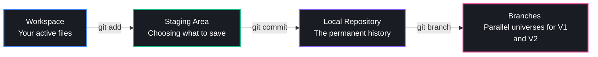
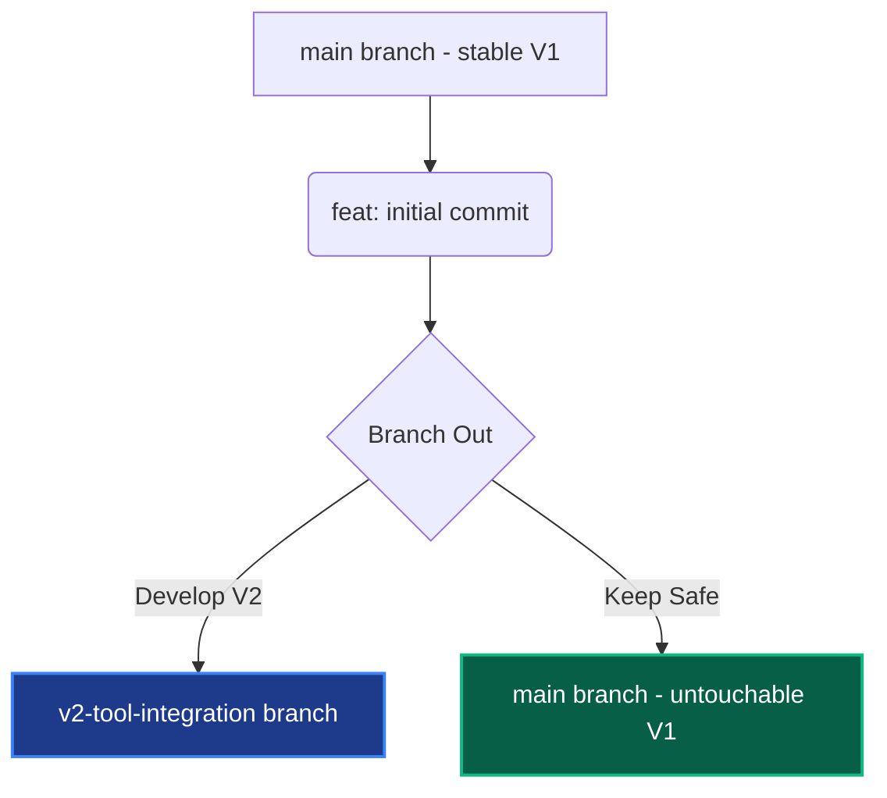

# 🎓 Mastering Version Control & Git through "My First AI Model"

Welcome! You are at a very exciting stage of development. You have built a beautiful, fully functional **V1** of your Streamlit AI assistant, and you're ready to start building **V2** by integrating new tools. 

Before we write a single line of code for V2, we are going to set up **Git** (the world's most popular version control system). This will act as your project's **Time Machine** and **Sandbox**, allowing you to experiment freely without the fear of breaking your working V1!

---

## 🌟 What is Version Control & Git?

Imagine writing a book. Instead of saving files like `draft_v1.py`, `draft_v2_final.py`, and `draft_v2_final_FINAL_v3.py`, Git lets you keep a **single** file (`first_try.py`) and tracks every single line change over time.

### The Git Workflow in a Nutshell


---

## 🛠️ Step 1: Initialize Git (`git init`)

Currently, your project is just a regular directory. We need to tell Git to start tracking it. 

Running `git init` creates a hidden `.git` folder in your project. This is where Git stores all your snapshots and history. 

> [!NOTE]
> We will run this command together in the next step, or you can run it yourself. It's the standard way to kickstart version control for any codebase.

---

## 🛡️ Step 2: The Shield — `.gitignore`

This is the **most crucial step** for your project! 
Your project currently contains a very sensitive file:
📁 `.streamlit/secrets.toml`

This file contains your **Google Client ID**, **Client Secret**, and **Cookie Secret**. If you ever upload your code to a public site like GitHub, anyone could steal these keys and abuse your Google Cloud account.

### How do we protect it?
We create a file named `.gitignore` in the root of your project. In it, we write the names of files and folders we want Git to **completely ignore**.

We want to ignore:
- `.streamlit/secrets.toml` (sensitive keys)
- `.env` (environment variables)
- `__pycache__/` (automatically generated Python cache files)

Here is exactly what your `.gitignore` will look like:
```text
# Exclude Streamlit local secrets and environment configs
.streamlit/secrets.toml
.env

# Exclude Python runtime caches
__pycache__/
*.pyc
```

---

## 📸 Step 3: Taking the First Snapshot (Save V1)

Saving files in Git is a two-step process:

1. **`git add .`**: This places your files (`first_try.py`, `style.css`, and `.gitignore`) into the **Staging Area** (like putting items into a shopping cart).
2. **`git commit -m "feat: initial commit of AI chatbot V1"`**: This officially purchases the items! It saves a permanent, encrypted snapshot of those files in their current state with a descriptive message.

---

## 🌿 Step 4: Branching — Creating the "V2 Sandbox"

This is where the magic of Git shines. By default, you are on the `main` (or `master`) branch. This is your stable, working V1.

Before we start integrating new tools, we will create a parallel universe (a **branch**) called `v2-tool-integration`:

```bash
git checkout -b v2-tool-integration
```



On your new branch:
- You can change, break, and refactor any code in `first_try.py` you want.
- If everything goes wrong, you can switch back to `main` with one command (`git checkout main`), and your beautiful, working V1 will be completely intact!
- Once your V2 tools are fully working and tested, you can **merge** the V2 branch back into `main`.

---

## 🔀 Step 5: How to Merge Branch Changes

Merging is the process of bringing the changes you made in your sandbox (`v2-tool-integration`) back into your main codebase (`master` or `main`).

Here is the exact step-by-step recipe to merge:

### 1. Save and Commit your V2 work
First, make sure all your V2 changes are committed in your sandbox:
```bash
git add .
git commit -m "feat: integrate tool support in V2"
```

### 2. Switch back to your stable branch
Switch your workspace back to the `master` (or `main`) branch:
```bash
git checkout master
```
*(Your directory will instantly revert to the clean V1 state!)*

### 3. Pull the V2 changes in
Execute the merge command to pull all the V2 changes into your stable branch:
```bash
git merge v2-tool-integration
```

### 4. ⚔️ What is a "Merge Conflict"?
If you modified the *same line* of the *same file* in both branches, Git won't know which one you want to keep. It will pause the merge and show you a visual indicator in your editor:
```text
<<<<<<< HEAD
(The code currently on master - V1)
=======
(The code from your sandbox - V2)
>>>>>>> v2-tool-integration
```
You simply delete the lines you don't want, remove the `<<<<<<<`, `=======`, and `>>>>>>>` markers, save the file, and commit to complete the merge!

---

## 🚀 Let's Do It Together!

Let's run these setup steps interactively! Here is our game plan:
1. **Create the `.gitignore` file** to protect your secrets.
2. **Initialize Git** in your project folder.
3. **Stage and Commit** your V1 codebase.
4. **Create a `v2-tool-integration` branch** so we are fully prepared to add new features!
